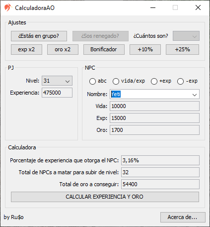

## CalculadoraAO [](https://sourceforge.net/p/calculadoraao/files/)
Calculadora multiplataforma basada en [ImperiumAO](https://www.imperiumao.com.ar/) que calcula el porcentaje de experiencia que otorga el NPC, la cantidad de NPCs a matar para pasar de nivel y el oro total. 
La idea original no es mía, yo solo hice algunas modificaciones, optimizando bastante el código original y agregando algunas funciones.



[](https://sourceforge.net/projects/calculadoraao/files/latest/download)

### Características
- Nivel máximo: 50.
- Tabla de niveles (ver [aquí](https://wiki.imperiumao.com.ar/niveles)).
- Tabla de NPCs (ver [aquí](https://wiki.imperiumao.com.ar/criaturas_hostiles)).
- Calcula la cantidad total de NPCs necesarios para pasar de nivel.
- Calcula el porcentaje de experiencia que otorga cada NPC.
- Calcula la cantidad total de oro a conseguir.
- Sistema de ajustes:
	- Servidor [PVP] (exp x5 y oro x3).
	- Servidor [RPG] (exp x1 y oro x1).
	- Grupos **Los renegados pierden un 10% de la experiencia total al formar grupos*.
	- Evento de experiencia x2.
	- Evento de oro x2.
	- Bonus adicional de +50%.
	- Bonus adicional de +100%.
	- Bonus adicional de +200%.
- Interfaz gráfica de usuario administrada por la librería [MigLayout](http://www.miglayout.com/).
- Es gratis y puede usarse con fines comerciales.

_Consulte [CHANGELOG.md](https://github.com/rusocode/CalculadoraAO/blob/master/CHANGELOG.md) para mas detalles_

### Getting started

Para el desarrollo sugerimos:
- Eclipse o IntellIJ IDEA
- JDK 8

Para ejecutar:
- **[JRE 8](https://www.java.com/es/download/)**

#### Maven
1. Clonar el repositorio en local
2. Importar como proyecto existente maven

_**IMPORTANTE!** Generar el JAR Ejecutable desde [Maven](https://maven.apache.org/download.cgi) y **NO** desde el IDE (solución en [Stack Overflow](https://stackoverflow.com/questions/40024242/how-to-load-resources-from-src-main-resources-in-a-way-that-will-work-both-dire))._
1. Copiar el plugin dentro del archivo pom.xml.
```xml
<!-- Plugin para generar el .jar con las dependencias includidas -->
<plugin>
	<groupId>org.apache.maven.plugins</groupId>
	<artifactId>maven-assembly-plugin</artifactId>
	<version>3.3.0</version>
	<configuration>
		<archive>
			<manifest>
				<mainClass>com.silentsoft.Launcher</mainClass> <!-- Indica la clase con el metodo main -->
			</manifest>
		</archive>
		<descriptorRefs>
			<descriptorRef>jar-with-dependencies</descriptorRef>
		</descriptorRefs>
	</configuration>
</plugin>
```
2. Ejecutar `mvn clean compile assembly:single` en consola para generar el .jar dentro de la carpeta target.

### Contacto
juandebenedetti94@gmail.com
